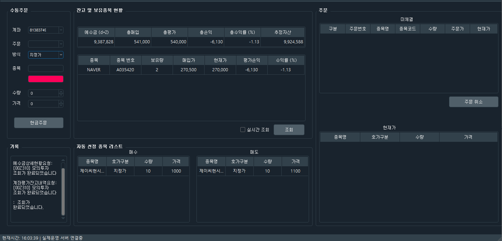

키움 Open API + 를 이용한 시스템트레이딩

## 개발환경
 - Anaconda3-4.3.0.1 32bit (Python 3.7, PyQt5.6, pandas)
 - Windows 10
 
## 사용법
 - 장 개시 전 매수할 을 data/Buy.json에, 매도할 종목을 data/Sell.json에 기록.
 - 장 개시 후 pytrader.py를 실행하면 Buy.json에 있는 종목을 매수, Sell.json에 있는 종목을 매도.

